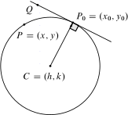

# Circunferencia

Sea $\vec{a}=(a_1,a_2)$ entonces el vector escalado es $r\vec{a}\parallel\vec{a}$; el vector perpendicular a este es $\vec{a}^\perp=(-a_2,a_1)$ la norma del vector $\vec{a}$ es $\left\|a\right\|=\sqrt{a_1^2+a_2^2}$ el vector unitario en la dirección de $\vec{a}$ es $\vec{\mu}=\frac{\vec{a}}{\left\|a\right\|}$ que es paralela a este. Dado dos puntos $P_1$ y $P_2$ estos definen un vector $\vec{P_1P_2}=P_2-P_1$. Los vectores en dirección de los ejes positivos son $i=(1,0)$ y $j=(0,1)$; cualquier vector se pueden expresar en términos de estos es decir $\vec{a}=(a_1,a_2)=a_1(1,0)+a_2(0,1)=a_1i+a_2j$. De acuerdo al ángulo de inclinación del vector se tiene la siguiente representación $\vec{a}=\left\|\vec{a}\right\|(\cos\theta,\sin\theta)$.

```{theorem, www, name="russ"}
Dada el espacio $R$ y $r\in R$ se tiene que $\mathcal{R}(r)=\lim_{t\to\infty}g(y)_r$
```
$\sum$

```{r C1, echo=FALSE, fig.cap="Elipse vectorial", fig.align="center"}

```

```{r C2, echo=FALSE, fig.cap="Elipse vectorial", fig.align="center"}
knitr::include_graphics("vector.svg")
```
Dos vectores son ortogonales ($\vec{a}\perp\vec{b}$) si $\left|\vec{a}-\vec{b}\right|=\left|\vec{a}+\vec{b}\right|$ y verifican

$\left|\vec{b}\right|^2+\left|\vec{b}\right|^2+=\left|\vec{a}+\vec{b}\right|^2$
$\vec{a}\vec{b}=0$
$\vec{a}\parallel\vec{b}^\perp$
$\vec{a}$ y $\vec{b}$ son LI si y solo si $r\vec{a}+s\vec{b}=0$ implica $r=0$ y $s=0$.

La proyeccion de $\vec{a}$ sobre $\vec{b}$ es otro vector $\text{Proy}_{\vec{b}}\vec{a}$

$\vec{a}=\text{Proy}_{\vec{b}}\vec{a}+\text{Proy}_{\vec{b}^\perp}\vec{a}$ si hacemos $\vec{a}=p\vec{b}+q\vec{b}^\perp$ entonces $q=\frac{\vec{a}\vec{b}}{\left\|\vec{b}\right\|^2}$ y $p=\frac{\vec{a}\vec{b}^\perp}{\left\|\vec{b}\right\|^2}$ pues $\left\|\vec{b}\right\|=\left\|\vec{b}^\perp\right\|$ entonces  $\text{Proy}_{\vec{b}}\vec{a}=\frac{\vec{a}\vec{b}}{\left\|\vec{b}\right\|^2}\vec{b}=\frac{\vec{a}\vec{b}}{\left\|\vec{b}\right\|}\frac{\vec{b}}{\left\|\vec{b}\right\|}=\text{Cp}_{\vec{b}}\vec{a}\frac{\vec{b}}{\left\|\vec{b}\right\|}$; $\text{Cp}_{\vec{b}}\vec{a}=\frac{\vec{a}\vec{b}}{\left\|\vec{b}\right\|}$ recibe el nombre de componente de $\vec{a}$ en la dirección de $\vec{b}$


Dado $P_0$ y un vector $\vec{a}$ entonces la recta se define como el conjunto de puntos $\mathcal{L}=\left\{P\in\mathbb{R}^2/P=P_0+t\vec{a};\: t\in \mathbb{R}\right\}$ que recibe el nombre de ecuación vectorial de la recta. $P\in\mathcal{L}\iff (P-P_0)\cdot\vec{a}^\perp=0$. De la ecuación vectorial de la recta se tiene si $P=(x.y)$; $P_0=(x_0,y_0)$ y $\vec{a}=(a_1,a_2)$ se tiene la ecuación paramétrica de la recta. $x=x_0+ta_1$; $y=y_0+ta_2$ de esto se obtiene la ecuación simétrica de la recta $$\frac{x-x_0}{a_1}=\frac{y-y_0}{a_2}.$$ Sea $\vec{n}=(a,b)=\vec{a}^\perp$ entonces se tiene que si $P\in \mathcal{L}$ entonces $(P-P_0)\cdot \vec{n}=0$ pues son perpendicualres; entonces $P\cdot \vec{n}=P_0\cdot \vec{n}\iff ax+by=-c\implies ax+by+c=0$ que recibe el nombre de ecuación general de la recta. Sea $Q=(x_1,y_1)$ un punto exterior a $\mathcal{L}$ entonces la distancia de $Q$ a $\mathcal{L}$ se define como


\begin{align*}d[Q;\mathcal{L}] & =\left|\text{Cp}_{\vec{n}}(Q-P_0)\right| \\
& =\left|\frac{(Q-P_0)\cdot\vec{n}}{\left|\vec{n}\right|}\right| \\
& =\left|\frac{Q\cdot\vec{n}-P_0\cdot\vec{n}}{\left|\vec{n}\right|}\right| \\
& =\frac{\left|ax_1+by_1+c\right|}{\sqrt{a^2+b^2}}
\end{align*}

Sean $\mathcal{L}_1$ y $\mathcal{L}_2$ dos rectas; con vectores directores $\vec{a}=(a_1,a_2)$ y $\vec{b}=(b_1,b_2)$ respectivamente; entonces $\mathcal{L}_1\cap\mathcal{L}_2=(d_1,d_2)$ donde $d_1$ y  $d_2$ satisfacen el sistema generado por las ecuaciones generales de $\mathcal{L}_1$ y $\mathcal{L}_2$; $a_1x+a_1y+k_1=0$ y $b_1x+b_1y+k_2=0$.

La pendiente de una recta se deduce de su vector director es decir si $\vec{a}=(a_1,a_2)$ entonces $m=\frac{a_2}{a_1}$; de esto se deduce $\vec{a}=(a_1,a_2)=a_1(1,\frac{a_2}{a_1})=a_1(1,m)$. El angulo generado por las $\mathcal{L}_1$ con pendiente $m_1$ y $\mathcal{L}_2$ con pendiente $m_1$; está dada por $\theta=\arctan\left(\frac{m_1-m_2}{1+m_1m_2}\right)$.

El círculo se define como el conjunto de punto $P=(x,y)$ que satisfacen la ecuación $$\left \|P-C\right\|=r$$ $r>0$ es el radio,  $C=(h,k)$ es el centro entonces la ecuación del círculo es $$\left \|P-C\right\|=r\iff (x-h)^2+(y-k)^2=r^2.$$

La ecuación de la recta tangente en $P_0=(x_0,y_0)$ ($P=P_0$ en el gráfico) está dada por $$(Q-P_0)\cdot(P_0-C)=0$$ donde $Q=(x,y)\neq P$ cualquiera; entonces $$(Q-P_0)\cdot(P_0-C)=0\iff  (x-x_0,y-y_0)(x_0-h,y_0-k)=0$$ lo cual es equivalente a $$(x-h)(x_0-h)+(x-k)(y_0-k)=r^2$$


