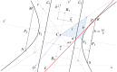

# Hiperbola

Los puntos $P$ de un hipérbola  verifican la siguiente ecuación
$$\left|\left|P-F_1\right|+\left|P-F_1\right|\right|=2a$$
$C=(h,k)$ es el centro de la hipérbola; $V_1$ y $V_2$ son los vértices; $F_1$ y $F_2$ son los focos; $\overline{V_1V_2}$ es el eje transversal; $\overline{B_1B_2}$ es el eje conjugado; $x'$ es el eje focal
$$d\left[C;F_1\right]=d\left[C;F_2\right]=c$$
$F_1=(-c,0)$; $F_1=(c,0)$ en el sistema coordenado $x'y'$; $\mathcal{C}$ circunferencia con centro en $C$, radio $c$ que pasa por los focos.

\[d\left[V_1;C\right]=d\left[V_2;C\right]=a\]


```{r hiperbola, echo=FALSE, out.width = '80%', fig.cap="Elipse vectorial", fig.align="center"}

```
$$\frac{d\left[P;F_1\right]}{d\left[P;\mathcal{L}_1\right]}=e=\frac{d\left[P;F_2\right]}{d\left[P;\mathcal{L}_2\right]}$$

$c=ae$; $d\left[C;\mathcal{L}_1\right]=d\left[C;\mathcal{L}_2\right]=\frac{a}{e}$ y $e>1$; en efecto $$\frac{d\left[R;F_1\right]}{d\left[R;\mathcal{L}_1\right]}=\frac{\frac{b^2}{a}}{c-d\left[C;\mathcal{L}_1\right]}=\frac{c^2-a^2}{a(c-d\left[C;\mathcal{L}_1\right])}$$

$$\frac{d\left[V_2;F_1\right]}{d\left[V_2;\mathcal{L}_1\right]}=\frac{c-a}{a-d\left[C;\mathcal{L}_2\right]}.$$

De la primera $$d\left[C;\mathcal{L}_2\right]=a-\frac{c-a}{e}\implies c-d\left[C;\mathcal{L}_2\right]=a-\frac{(c-a)(e+1)}{e}.$$

De la segunda ecuación $$c^2-a^2=ae\frac{(c-a)(e+1)}{e}\implies c+a=a(e+1)\implies c=ae$$ luego $d\left[C;\mathcal{L}_2\right]=a-\frac{(c-a)(ae+a)}{e}=\frac{a}{e}$ y el caso  $d\left[C;\mathcal{L}_1\right]$ es similar. Finalmente $e=\frac{c}{a}>1$ pues $0<a<c.$

$P=(x,y)=C+x'\vec{u}+y'\vec{u}^\perp$ $x'=[(x,y)-C]\vec{u}$ y $y'=[(x,y)-C]\vec{u}^\perp$

$F_1=C+c\vec{u}$ y $F_2=C-c\vec{u}$ tambien $V_1=C+a\vec{u}$ y $V_2=C-a\vec{u}$ entonces $$\frac{d\left[P;F_1\right]}{d\left[P;\mathcal{L}_1\right]}=e\iff d\left[P;F_1\right]^2=e^2d\left[P;\mathcal{L}_1\right]^2$$ haciendo uso de $c=ae$ y $c^2=a^2+b^2$ se tiene lo siguiente

$$(x'-c)^2+y'^2=e^2\left(x'-\left(\frac{a}{e}\right)\right)^2$$

$$(c^2-a^2) x'^2+a^2y'^2=a^2(c^2-a^2)$$

$$b^2x'^2-a^2y'^2=a^2b^2$$

De este modo $P\in\mathcal{H}$ si $P$ satisface la ecuación vectorial $$P=(x,y)=V+x'\vec{u}+y'\vec{u}^\perp;\: \text{donde } \frac{x'^2}{a^2}-\frac{y'^2}{b^2}=1; \:\left|\vec{u}\right|=1.$$

Cuando el eje es paralelo al eje $x$; $\vec{u}=i=(1,0)$ entonces $(x,y)=V+x'\vec{u}+y'\vec{u}^\perp=(h+x',k+y')\implies x'=x-h$ y $y'=y-k$ en $\frac{x'^2}{a^2}-\frac{y'^2}{b^2}=1$; resulta $\frac{(y-k)^2}{a^2}-\frac{(y-k)^2}{b^2}=1$; ($\frac{x^2}{a^2}-\frac{y^2}{b^2}=1$; si $V$ está en el origen); entonces $F_1=C+c\vec{u}=(h-\frac{a}{e},k)$ y $F_2=C+c\vec{u}=(h-\frac{a}{e},k)$; $\mathcal{L}_1: x=h-\frac{a}{e}$ y  $\mathcal{L}_2: x=h+\frac{a}{e}$ y las asíntotas de $y'=\pm\frac{a}{b}x'$ se convierte en  $(y-k)=\pm\frac{a}{b}(x-h)$.

Cuando el eje es paralelo al eje $y$; $\vec{u}=j=(0,1)$ entonces $(x,y)=V+x'\vec{u}+y'\vec{u}^\perp=(h-y',k+x')\implies x'=y-k$ y $y'=h-x$  en $\frac{x'^2}{a^2}-\frac{y'^2}{b^2}=1$; resulta $\frac{(y-k)^2}{a^2}-\frac{(y-k)^2}{b^2}=1$; ($\frac{x^2}{a^2}-\frac{y^2}{b^2}=1$; si $V$ está en el origen); entonces $F_1=C+c\vec{u}=(h+c,k)$; $\mathcal{L}_1: x=k+\frac{a}{e}$ y  $\mathcal{L}_2: x=k-\frac{a}{e}$ y las asíntotas de $y'=\pm\frac{b}{a}x'$ se convierte en  $(y-k)=\pm\frac{b}{a}(x-h)$.
