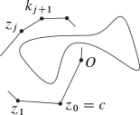

--- 
title: "Geométria analítica"
author: "Ricardo Michel MALLQUI BAÑOS"
date: "`r Sys.Date()`"
site: bookdown::bookdown_site
documentclass: book
fontsize: 12pt
bibliography: [book.bib, packages.bib]
biblio-style: apalike
link-citations: yes
description: "Tópicos de geometría analítica"
---
\newcommand{\N}{\mathbb{N}}
\newcommand{\R}{\mathbb{R}}
\newcommand{\CC}{\mathbb{C}}
\newcommand{\I}{\mathbb{I}}
\newcommand{\f}{\mathbb{f}}
\newcommand{\X}{\mathbb{X}}
\newcommand{\D}{\mathbb{D}}
\newcommand{\Z}{\mathbb{Z}}
\newcommand{\Q}{\mathbb{Q}}
\newcommand{\norm}[1]{\left\Vert#1\right\Vert}
\newcommand{\abs}[1]{\left\vert#1\right\vert}
\newcommand{\set}[1]{\left\{#1\right\}}
\newcommand{\seq}[1]{\left<#1\right>}
\newcommand{\co}[1]{\left[#1\right]}
\newcommand{\cc}[1]{\left(#1\right)}
\newcommand{\J}{\mathcal{J}}
\newcommand{\K}{\mathcal{K}}
\newcommand{\M}{\mathcal{M}}
\newcommand{\F}{\mathcal{F}}

# Prerequisitos


See Theorem \@ref(thm:boring) \[\sum_1^2\]
```{r pressure2, echo=FALSE, fig.cap="ww", fig.align="center"}
knitr::include_graphics("inverse.svg")
```

```{theorem, boring}
Here is my theorem.
```{definition, name="ww"}
```
See Figure \@ref(fig:cars-plot) \@ref(fig:pressure)
```{r pressure1, echo=FALSE, fig.cap="ww", fig.align="center",out.width = "20%"} 
knitr::include_graphics("U.svg")
```

```{r cars-plot, fig.cap="A plot caption"}
plot(cars)  # a scatterplot
```


```{theorem, pyth, name="Pythagorean theorem"}
For a right triangle, if $c$ denotes the length of the hypotenuse
and $a$ and $b$ denote the lengths of the other two sides, we have

$$a^2 + b^2 = c^2$$
```
See Table \@ref(tab:mtcars)

```{r pressure, echo=FALSE, fig.cap="A caption", out.width = '100%', fig.align="center"}
knitr::include_graphics("inverse.pdf")
```

```{r mtcars}
knitr::kable(mtcars[1:5, 1:5], caption = "A caption", booktabs=TRUE)
```

\begin{equation} 
  f\left(k\right) = \binom{n}{k} p^k\left(1-p\right)^{n-k}
  (\#eq:binom)
\end{equation} 

Este es un  _ejemplo_ book written in **Markdown** \@ref(eq:binom). You can use anything that Pandoc's Markdown supports, e.g., a math equation $a^2 + b^2 = c^2$.

The **bookdown** package can be installed from CRAN or Github:

```{r eval=FALSE}
install.packages("bookdown")
# or the development version
# devtools::install_github("rstudio/bookdown")
```

Remember each Rmd file contains one and only one chapter, and a chapter is defined by the first-level heading `#`.

To compile this example to PDF, you need XeLaTeX. You are recommended to install TinyTeX (which includes XeLaTeX): <https://yihui.org/tinytex/>.

```{r include=FALSE}
# automatically create a bib database for R packages
knitr::write_bib(c(
  .packages(), 'bookdown', 'knitr', 'rmarkdown'
), 'packages.bib')
```


```{r pressure3, echo=FALSE, fig.cap="ww", fig.align="center"} 

```
